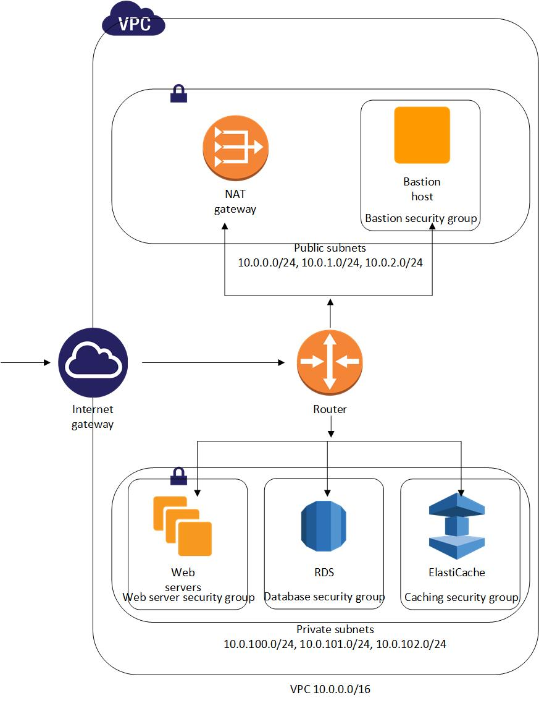

# Aws Getting Started



## Create VPC, Public Subnets and Private Subnets
#### VPC
1. Your VPCs -> Create VPC 
2. Create VPC
3. VPC Settings
```
Name tag: americano-vpc
IPv4 CIDR Block: 10.0.0.0/16
IPv6 CIDR block: No IPv6 CIDR block
Tenancy: Default
```

#### Public Subnets
Create 3 public subnets in 3 availability zones

1. Subnets -> Create subnet
2. Create subnet
3. VPC:
```
VPC ID: americano-vpc
```
4. Subnet settings:
```
Subnate name: americano-public-subnet-a
Availability Zone: Asia Pacific (Sydney) / ap-southeast-2a
IPv4 CIDR block: 10.0.0.0/24
```
5. Press "Create subnet" button
6. Create another 2 subnets
7. Create subnet
8. VPC:
```
VPC ID: americano-vpc
```
9. Subnet settings:
```
Subnate name: americano-public-subnet-b
Availability Zone: Asia Pacific (Sydney) / ap-southeast-2b
IPv4 CIDR block: 10.0.1.0/24
```
10. Press "Create subnet" button
11. Create subnet
12. VPC: 
```
VPC ID: americano-vpc
```
13. Subnet settings:
```
Subnate name: americano-public-subnet-c
Availability Zone: Asia Pacific (Sydney) / ap-southeast-2c
IPv4 CIDR block: 10.0.1.0/24
```
14. Press "Create subnet" button

#### Private Subnets
Create 3 private subnets in 3 availability zones

1. Subnets -> Create subnet
2. Create subnet
3. VPC: 
```
VPC ID: americano-vpc
```
4. Subnet settings:
```
Subnate name: americano-private-subnet-a
Availability Zone: Asia Pacific (Sydney) / ap-southeast-2a
IPv4 CIDR block: 10.0.100.0/24
```
5. Press "Create subnet" button
6. Subnets -> Create subnet
7. Create subnet
8. VPC: 
```
VPC ID: americano-vpc
```
9. Subnet settings:
```
Subnate name: americano-private-subnet-c
Availability Zone: Asia Pacific (Sydney) / ap-southeast-2b
IPv4 CIDR block: 10.0.101.0/24
```
10. Press "Create subnet" button
11. Subnets -> Create subnet
12. Create subnet
13. VPC: 
```
VPC ID: americano-vpc
```
14. Subnet settings:
```
Subnate name: americano-private-subnet-c
Availability Zone: Asia Pacific (Sydney) / ap-southeast-2c
IPv4 CIDR block: 10.0.102.0/24
```
15. Press "Create subnet" button

## Create Internet Gateways, Route Tables and NAT Gateways
#### Internet Gateways
Public subnet can communicate with internet and internet can access instances inside public subnet

1. Internet Gateways -> Create internet gateway
2. Create internet gateway
```
Internet gateway settings
Name tag:  americano-vpc-ig
```
3. Press "Create internet gateway" button
4. Attach to a VPC / Action -> Attach to VPC / Select ig-cafeamericano-vpc from the table, Click Action -> Attach to VPC
```
Attach to VPC (igw-<id>)
```
```
VPC
Available VPCs: americano-vpc
```
5. Press "Attach internet gateway" button

#### Route Tables
Create route table for internet gateway

1. Route Tables -> Create route table
2. Create route table
```
Name tag: americano-public-route
VPC: americano-vpc
```
3. Press "Create", then "Close" button
4. Select americano-public-route row from the list
5. Click Subnet Associations tab
6. Click "Edit subnet associations" button
7. Select all public subnets, i.e. americano-public-subnet-a, americano-public-subnet-b and americano-public-subnet-c
8. Then press "Save" button
9. Select Routes tab
10. Select "Edit routes" -> Add route
```
Destination: 0.0.0.0/0
Target: americano-vpc-ig
```
11. Press "Save routes" button
12. Then "Close" button

#### NAT Gateways
Private subnet can go through internet

1. NAT Gateways -> Create NAT gateway
2. Create NAT gateway
```
NAT gateway settings
Name: americano-nat-gateway
Subnet: americano-public-subnet-a (One of the public subnet)
Elastic IP allocation ID: Press Allocate Elastic IP button
```
3. Press Create NAT gateway button
4. Then go to Route Tables page
5. Route Tables -> Create route table
```
Create route table
Name tag: americano-nat-gateway-route
VPC: americano-vpc
```
6. Press "Create", then "Close" button
7. Select americano-nat-gateway-route row from the list
8. Click Subnet Associations tab
9. Click "Edit subnet associations" button
10. Select all private subnets, i.e. americano-private-subnet-a, americano-private-subnet-b and americano-private-subnet-c
11. Then press "Save" button
12. Select Routes tab
13. Select "Edit routes" -> Add route
```
Destination: 0.0.0.0/0
Target: americano-nat-gateway
```
14. Press "Save routes" button
15. Then "Close" button

## Create Security Groups
Create 3 security groups

1. Create security groups
2. Basic details
```
Security group name: americano-bastion-sg
Description: Bastion server security group
VPC: americano-vpc
```
3. Inbound rules
4. Press Add rule button
```
Type: SSH
IP: 0.0.0.0/0
```
5. Click "Create security group" button
6. Create security groups
7. Basic details
```
Security group name: americano-web-servers-sg
Description: Web servers security group
VPC: americano-vpc
```
8. Click "Create security group" button
9. Create security groups
10. Basic details
```
Security group name: americano-postgres-sg
Description: Postgres database security group
VPC: americano-vpc
```
11. Inbound rules
12. Press Add rule button
```
Type: PostgreSQL
Source: americano-bastion-security-group
```
13. Press Add rule button
```
Type: PostgreSQL
Source: americano-web-servers-security-group
```
14. Click "Create security group" button


## Configure RDS with Postgres
1. Sign in to the AWS Management Console.
2. Go to the Services dropdown menu at the top left corner
3. Choose RDS from the menu
4. Select Subnet Groups at the left menu
5. Select Create DB Subnet Group
```
Create DB Subnet Group:
Subnet group details:
Name: americano-private-subnets
Description: Americano private database subnet group
VPC: americano-vpc
Add subnets:
Availability Zones: ap-southeash-2a, ap-southeast-2b, ap-southeast-2c
Subnets: 10.0.100.0/24, 10.0.101.0/24, 10.0.102.0/24
```
6. Click Create button
7. Select Databases at the left menu
8. Select Create database button
9. Create database:
```
Choose a database creation method: Select Standard create

Engine options
Engine type: Select PostgreSQL
Version: Latest (PostgreSQL 12.4-R1)

Templates: Free tier

Settings:
DB instance identifier:
Credentials Settings:
Master username: postgres
Auto generate a password: Uncheck
Master password: password
Confirm password: password


DB instance size:
DB instance class:
Burstable classes (includes t classes)
db.t2.micro
Include previous generation classes: off

Storage: 
Storage type: General Purpose (SSD)
Allocated storage: 20
Storage autoscaling:
Enable storage autoscaling: Uncheck

Connectivity:
Virtual private cloud (VPC): americano-vpc
Subnet group: americano-db-private-subnets
Public access: No
VPC security group: Choose existing
Existing VPC security groups: americano-postgres-security-group
Availability Zone: No preference

Database authentication:
Database authentication options: Password authentication

Additional configuration:
Backup:
Enable automatic backups: Uncheck
Performacne Insights: 
Enable Performance Insights: Uncheck
```
10. Click Create database button

## Configure ElastiCache with Redis
1. Click Create button
```
Create your Amazon ElastiCache Cluster
Cluster engine: Redis
Cluster Mode enabled: Uncheck

Location
Choose a location: Amazon Cloud

Redis settings
Name: americano-elasticache
Engine version compatibility: 6.x
Port: 6379
Parameter group: default.redis6.x
Node type: cache.t2.micro
Number of replicas: 0

Advanced Redis settings
Subnet group: Create new
Name: americano-cache-private-subnets
VPC ID: americano-vpc
Subnets: 10.0.100.0/24, 10.0.101.0/24, 10.0.102.0/24
Availability zones placement: No preference

Security
Security groups: americano-redis-security-group

Backup
Enable automatic backups: Uncheck
```
2. Press Create button

## Access RDS from 
**Todo**

## Create bastion server
1. Sign in to the AWS Management Console.
2. Go to the Services dropdown menu at the top left corner
3. Choose EC2 from the menu
4. Click Launch Instance button
5. Select Amazon Linux instance
6. Choose an Instance Type: t2.micro
7. Select Next: Configure Instance Details button
8. On Step 3: Configure Instance Details page, enter as follows
```
Network: americano-vpc
Subnet: Public Subnet A
Auto-assign Public IP: Enable
```
9. Click Next: Add Storage button
10. Click Next: Add Tags button
11. On Step 5: Add Tags page, press Add Tag button
12. Enter as follows
```
Key: Name
Value: Bastion server
```
13. Click Next: Configure Security Group
14. On Step 6: Configure Security Group page, select americano-bastion-sg
15. Click Review and Launch
16. Click Launch button
17. In the Select an existing key pair or create a new key pair dialog box, choose Create a new key pair, enter a name for the key pair, and then choose Download Key Pair
18. Select the acknowledgement check box
19. Choose Launch instances
20. A confirmation page lets you know that your instance is launching
21. Choose View Instances to close the confirmation page and return to the console.


## Create Elastic Beanstalk

#### Elastic Beanstalk
1. Sign in to the AWS Management Console.
2. Go to the Services dropdown menu at the top left corner
3. Choose Elastic Beanstalk from the menu
4. Click "Create Application" button
5. On "Create a web app" page, enter as follows:
```
Application information
Application name: americano-beanstalk

Platform
Platform: .NET Core on Linux
Platform branch: .NET Core running on 64bit Amazon Linux 2
Platform version: 2.1.1 (Recommended)

Application code: Sample application
```
6. Click "Configure more options" button
7. Edit Network
```
Modify network

Virtual private cloud(VPC)
VPC: americano-vpc
Instance settings:
Public IP address: uncheck
Instance subnets: 10.0.101.0/24, 10.0.100.0/24, 10.0.102.0/24
```
8. Click "Save" button
9. Edit Instances
```
Modify instances
EC2 security groups: americano-webserver-sg
```
10. Click "Save" button
11. Click "Create" button

#### Create dotnet MVC project
1. Create a new directory to hold a project
```
PS C:\>mkdir beanstalk-net
PS C:\>cd beanstalk-net
```
2. Create a new dotnet core mvc project. _Using dotnet cli to scaffold the new project._
```
PS  C:\beanstalk-net>dotnet new mvc
PS  C:\beanstalk-net>dotnet build
PS  C:\beanstalk-net>dotnet run
```
3. Open any browser window
4. Go to link http://localhost:5000
5. Include EntityFramework and PostgreSQL NuGet package.
```
PS  C:\beanstalk-net>dotnet add package Microsoft.EntityFrameworkCore
PS  C:\beanstalk-net>dotnet add package Microsoft.EntityFrameworkCore.Design
PS  C:\beanstalk-net>dotnet add package Npgsql.EntityFrameworkCore.PostgreSQL
PS  C:\beanstalk-net>dotnet add package Npgsql
```
6. Include Redis dotnet client NuGet package
```
PS  C:\beanstalk-net>dotnet add package StackExchange.Redis
```
7. Publish website
```
dotnet publish -c Release -o site
```
8. Zip the output folder __site__ without parent directory
``` 
PS  C:\beanstalk-net>tar.exe -avc -f site.zip site\*
```

###### Remove folder and file
```
C:\beanstalk-net>rm -r -force .\site\
C:\beanstalk-net>rm .\deploy-bundle.zip
```

####


