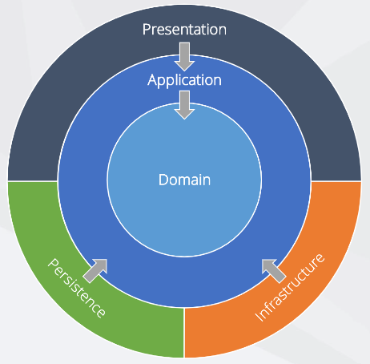

## Software Architecture
https://github.com/jasontaylordev/CleanArchitecture 

## Code Smells
&nbsp; |  &nbsp;
-- | --
Large Class | Extract Class   Extract Subclass   Extract Interface
Long Method | Replace Method with Method Object   Compose Method   Extract Method   Move Method

#### Core project
- Interfaces
- Aggregates 
    - Entities
- Value Objects
- Domain Services
- Domain Exception

- Domain Events, Events Handlers
- Specifications
- Validators
- Enums
- Custom Guards

Shared Kernel